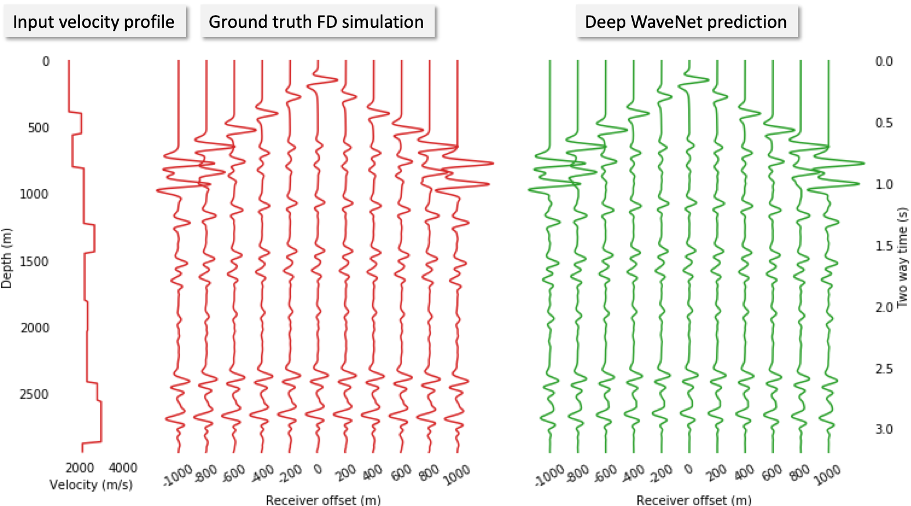
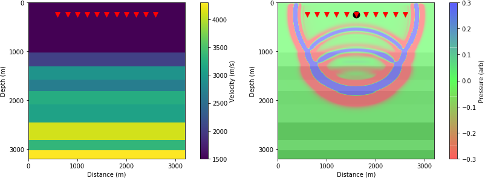
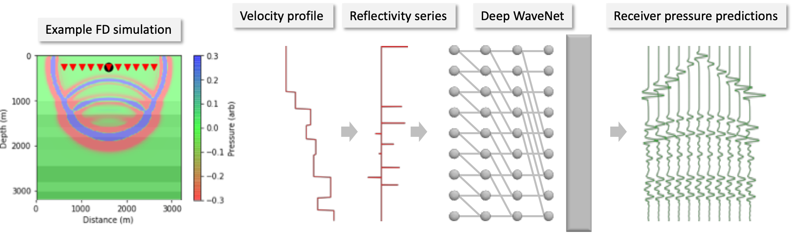

# Fast approximate simulation of seismic waves using WaveNet

---

Author: Ben Moseley, Centre for Autonomous Intelligent Machines and Systems, University of Oxford, bmoseley@robots.ox.ac.uk 

This repository reproduces the results of the paper: *[Fast approximate simulation of seismic waves with deep learning](https://arxiv.org/abs/1807.06873), NeurIPS 2018, B. Moseley, A. Markham and T. Nissen-Meyer*.

Last updated: Jan 2019

---




## Overview

- **Seismic simulation** is crucial for many geophysical applications, yet traditional approaches are **computationally expensive**.

- In this workshop, we will use **deep learning** to simulate seismic waves.

- We will show that this can offer a **fast approximate alternative** to traditional simulation methods.

---

This workshop takes ~ 1-2 hrs to complete. All the code for this notebook can be found here: https://github.com/benmoseley/seismic-simulation-wavenet

---

## Task

For this proof of principle study, we will consider the simulation of **acoustic waves** propagating in synthetic **horizontally layered** media.

Specifically, we will consider a single fixed point source propagating through a horizonally layered velocity model with 11 fixed receivers horizontally offset from the source, shown below.

<!---include "" for proper github rendering-->

Left: input velocity model, triangles show receiver locations. Right: wavefield pressure after 1 s, using acoustic Finite-Difference (FD) modelling,  black circle shows fixed point source location.

Our task is as follows:

> Given a randomly selected layered velocity model as input, can we train a neural network to simulate the pressure response recorded at each receiver location?

We wish our neural network to generalise well to velocity models unseen during training. We will compare our results to traditional FD modelling.


## Workflow

We will use the following workflow to complete this task;

- we will preprocess the input velocity profile into its corresponding reflectivity series;

- we will pass this to a deep neural network with a **WaveNet** architecture to simulate the receiver responses;

- we will train this network with many example ground truth FD simulations;

- we will compare the accuracy and computational performance of the trained network to FD simulation.

This workflow is shown below.




## Installation

seismic-simulation-wavenet only requires Python libraries to run. We recommend setting up an new environment, for example
```bash
conda create -n workshop python=3.6  # Use Anaconda package manager
source activate workshop
```
and then installing the following dependencies:
```bash
pip install --ignore-installed --upgrade [packageURL]# install tensorflow (get packageURL from https://www.tensorflow.org/install/pip, see tensorflow website for details)
pip install tqdm requests
conda install matplotlib jupyter
```

then downloading this source code:

```bash
git clone https://github.com/benmoseley/seismic-simulation-wavenet.git
```
